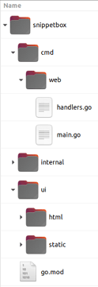

---
runme:
  id: 01HH2JEX11Q5BQQKVJM3YGD3MV
  version: v2.0
---

# Concepts

## Module Path

A module path is basically a canonical name or identifier for your project.
You can pick almost any string as your module path, but the important thing to
focus on is *uniqueness*.
Example: `snippetbox.maya.net`

If you do `go mod init snippetbox.maya.net`, in the snippetbox directory, you'll
create a `go.mod` file.
This makes your snippetbox a `module`.

Setting up your project as a module has a number of advantages — including
making it much easier to manage third-party dependencies, avoid supply-chain
attacks, and ensure reproducible builds of your application in the future.

## Go run

The `go run` command is a convenience.
It's essentially a shortcut that compiles your code, creates an executable
binary in your `/tmp` directory, and then runs this binary in one step.

## servemux

It doesn’t support routing based on the request method, it doesn’t support clean
URLs with variables in them, and it doesn’t support regexp-based patterns.

## servemux paths

Go’s `servemux` supports two different types of URL patterns: *fixed paths* and
*subtree paths*.
Fixed paths don’t end with a trailing slash, whereas subtree paths do end with a
trailing slash.

Fixed path patterns matches exactly.

If it helps your understanding, you can think of subtree paths as
acting a bit like they have a wildcard at the end, like `"/**"` or
`"/static/**"`

This helps explain why the `"/"` pattern is acting like a catch-all.
The pattern essentially means match a single slash, followed by anything (or
nothing at all).

## The DefaultServeMux

The `http.HandleFunc()` registers route with the default global `servermux`.
Not recommended for production.
Because `DefaultServeMux` is a global variable, any package can access it and
register a route — including any third-party packages that your application
imports.
If one of those third-party packages is compromised, they could use
DefaultServeMux to expose a malicious handler to the web.

## Servemux features and quirks

- In Go’s `servemux`, longer URL patterns always take precedence over shorter
   ones. This has the nice side-effect that you can register patterns in any order
   and *it won’t change how the `servemux` behaves*.
- Request URL paths are automatically sanitized. If the request path contains
   any `.` or `..` elements or repeated slashes, the user will automatically be
   redirected to an equivalent clean URL. For example, if a user makes a request to
   `/foo/bar/..//baz` they will automatically be sent a `301 Permanent Redirect` to
   `/foo/baz` instead.
- If a subtree path has been registered and a request is received for that
   subtree path *without* a trailing slash, then the user will automatically be
   sent a `301 Permanent Redirect` to the subtree path with the slash added. For
   example, if you have registered the subtree path `/foo/`, then any request to
   `/foo` will be redirected to `/foo/`.

## Host name matching

```go {"id":"01HH53EZFDK4CC0GX2VMC7JXQH"}
// This works
mux := http.NewServeMux()
mux.HandleFunc("foo.example.org/", fooHandler)
mux.HandleFunc("bar.example.org/", barHandler)
mux.HandleFunc("/baz", bazHandler)
```

When it comes to pattern matching, any host-specific patterns will be checked
first and if there is a match the request will be dispatched to the
corresponding handler. Only when there isn’t a host-specific match found will
the non-host specific patterns also be checked.

## Customizing headers

Changing the response header map after a call to `w.WriteHeader()` or
`w.Write()` will have no effect on the headers that the user receives. You need
to make sure that your response header map contains all the headers you want
*before* you call these methods.

## System-generated headers and content sniffing

When sending a response Go will automatically set three system-generated headers
for you: `Date` and `Content-Length` and `Content-Type`.

The `Content-Type` header is particularly interesting. Go will attempt to set
the correct one for you by content sniffing the response body with the
`http.DetectContentType()` function. If this function can’t guess the content
type, Go will fall back to setting the header
`Content-Type: application/octet-stream` instead.

The `http.DetectContentType()` function generally works quite well, but a common
gotcha for web developers new to Go is that it can’t distinguish JSON from plain
text. So, by default, JSON responses will be sent with a
`Content-Type: text/plain; charset=utf-8` header. You can prevent this from
happening by setting the correct header manually like so:

```go {"id":"01HH53EZFDK4CC0GX2VQHK6A3Q"}
w.Header().Set("Content-Type", "application/json")
w.Write([]byte(`{"name":"Alex"}`))
```

## Header Canonicalization

When you’re using the `Set()`, `Add()`, `Del()`, `Get()` and `Values()` methods
on the header map, the header name will always be canonicalized using the
`textproto.CanonicalMIMEHeaderKey()` function.
This converts the first letter and any letter following a hyphen to upper case,
and the rest of the letters to lowercase.
This has the practical implication that when calling these methods the header
name is case-insensitive.

If you need to avoid this canonicalization behavior you can edit the underlying
header map directly (it has the type `map[string][]string`). For example:

w.Header()["X-XSS-Protection"] = []string{"1; mode=block"}

## Suppressing system-generated headers

The `Del()` method doesn’t remove system-generated headers. To suppress these,
you need to access the underlying header map directly and set the value to
`nil`. If you want to suppress the `Date` header, for example, you need to
write:

```go {"id":"01HH53EZFDK4CC0GX2VRBGYMKV"}
w.Header()["Date"] = nil
```

## A tried and tested project structure



- The `cmd` directory will contain the *application-specific* code for the
   executable applications in the project. For now we’ll have just one executable
   application — the web application — which will live under the `cmd/web`
   directory.
- The `internal` directory will contain the ancillary *non-application-specific*
   code used in the project. We’ll use it to hold potentially reusable code like
   validation helpers and the SQL database models for the project.
- The `ui` directory will contain the *user-interface assets* used by the web
   application. Specifically, the `ui/html` directory will contain HTML templates,
   and the `ui/static` directory will contain static files (like CSS and images).

2 big benefits of this structure:

1. It gives a clean separation between Go and non-Go assets. All the Go code we
   write will live exclusively under the `cmd` and `internal` directories, leaving
   the project root free to hold non-Go assets like UI files, makefiles and module
   definitions (including our `go.mod` file). This can make things easier to manage
   when it comes to building and deploying your application in the future.
2. It scales really nicely if you want to add another executable application to
   your project. For example, you might want to add a CLI (Command Line Interface)
   to automate some administrative tasks in the future. With this structure, you
   could create this CLI application under `cmd/cli` and it will be able to import
   and reuse all the code you’ve written under the `internal` directory.

## The internal directory

It’s important to point out that the directory name `internal` carries a special
meaning and behavior in Go: any packages which live under this directory can
only be imported by code *inside the parent of the* `internal` *directory*. In
our case, this means that any packages which live in `internal` can only be
imported by code inside our `snippetbox` project directory.

Or, looking at it the other way, this means that any packages under `internal`
*cannot be imported by code outside of our project*.

This is useful because it prevents other codebases from importing and relying on
the (potentially unversioned and unsupported) packages in our internal directory
— even if the project code is publicly available somewhere like GitHub.

## Serving single files

Sometimes you might want to serve a single file from within a handler. For this
there’s the `http.ServeFile()` function, which you can use like so:

```go {"id":"01HH68ZYEFPRDKMZKZRRHHXTTR"}
func downloadHandler(w http.ResponseWriter, r *http.Request) {
	http.ServeFile(w, r, "./ui/static/file.zip")
}
```

**Warning:** `http.ServeFile()` does not automatically sanitize the file path.
If you’re constructing a file path from untrusted user input, to avoid directory
traversal attacks you *must* sanitize the input with `filepath.Clean()` before
using it.

## Disabling directory listings

If you want to disable directory listings there are a few different approaches
you can take.
The simplest way? Add a blank `index.html` file to the specific directory that
you want to disable listings for. This will then be served instead of the
directory listing, and the user will get a `200 OK` response with no body.
If you want to do this for all directories under `./ui/static` you can use the
command:

```sh {"id":"01HH68ZYEG343NDZ03X3TA1FYJ"}
#!/bin/sh

find ./ui/static -type d -exec touch {}/index.html \;
```

A more complicated (but arguably better) solution is to create a custom
implementation of `http.FileSystem`, and have it return an `os.ErrNotExist`
error for any directories. A full explanation and sample code can be found in
this [blog post](https://www.alexedwards.net/blog/disable-http-fileserver-directory-listings).

## Handler Function

A handler is an object which satisfies the `http.Handler` interface:

```go {"id":"01HH68ZYEG343NDZ03X4DYEX49"}
type Handler interface {
	ServeHTTP(ResponseWriter, *Request)
}
```

In simple terms, this basically means that to be a handler an object must have a
`ServeHTTP()` method with the exact signature:

```go {"id":"01HH68ZYEG343NDZ03X4TG0779"}
ServeHTTP(http.ResponseWriter, *http.Request)
```

So in its simplest form a handler might look something like this:

```go {"id":"01HH68ZYEG343NDZ03X81MZRSP"}
type home struct {}

func (h *home) ServeHTTP(w http.ResponseWriter, r *http.Request) {
	w.Write([]byte("This is my home page"))
}
```

Here we have an object (in this case it’s a `home` struct, but it could equally
be a string or function or anything else), and we’ve implemented a method with
the signature `ServeHTTP(http.ResponseWriter, *http.Request)` on it. That’s all
we need to make a handler.

You could then register this with a servemux using the `Handle` method like so:

```go {"id":"01HH68ZYEG343NDZ03X9XREJ17"}
mux := http.NewServeMux()
mux.Handle("/", &home{})
```

When this servemux receives a HTTP request for `"/"`, it will then call the
`ServeHTTP()` method of the home struct — which in turn writes the HTTP
response.

Now, creating an object just so we can implement a `ServeHTTP()` method on it is
long-winded and a bit confusing. Which is why in practice it’s far more common
to write your handlers as a normal function (like we have been so far).
For example:

```go {"id":"01HH68ZYEG343NDZ03XD7WTWDY"}
func home(w http.ResponseWriter, r *http.Request) {
	w.Write([]byte("This is my home page"))
}
```

But this `home` function is just a normal function; it doesn’t have a
`ServeHTTP()` method. So in itself it *isn’t* a handler.

Instead we can transform it into a handler using the `http.HandlerFunc()`
adapter, like so:

```go {"id":"01HH68ZYEG343NDZ03XEV260Z6"}
mux := http.NewServeMux()
mux.Handle("/", http.HandlerFunc(home))
```

The `http.HandlerFunc()` adapter works by automatically adding a `ServeHTTP()`
method to the `home` function. When executed, this `ServeHTTP()` method then
simply *calls the content of the original `home` function*. It’s a roundabout
but convenient way of coercing a normal function into satisfying the
`http.Handler` interface.

Throughout this project so far we’ve been using the `HandleFunc()` method to
register our handler functions with the servemux. This is just some syntactic
sugar that transforms a function to a handler and registers it in one step,
instead of having to do it manually. The code above is functionality equivalent
to this:

```go {"id":"01HH68ZYEG343NDZ03XGQ1GN84"}
mux := http.NewServeMux()
mux.HandleFunc("/", home)
```

## Environment Variables

If you want, you can store your configuration settings in environment variables
and access them directly from your application by using the `os.Getenv()`
function like so:

```go {"id":"01HH7N6EPC1J4K2EY2Z9QHE8C9"}
addr := os.Getenv("SNIPPETBOX_ADDR")
```

But this has some drawbacks compared to using command-line flags. You can’t
specify a default setting (the return value from `os.Getenv()` is the empty
string if the environment variable doesn’t exist), you don’t get the `-help`
functionality that you do with command-line flags, and the return value from
`os.Getenv()` is *always* a string — you don’t get automatic type conversions
like you do with `flag.Int()` and the other command line flag functions.

Instead, you can get the best of both worlds by passing the environment variable
as a command-line flag when starting the application. For example:

```sh {"id":"01HH7N6EPC1J4K2EY2Z9Y4KB3P"}
export SNIPPETBOX_ADDR=":9999"
go run ./cmd/web -addr=$SNIPPETBOX_ADDR
```

## Boolean flags

For flags defined with `flag.Bool()` omitting a value is the same as writing
`-flag=true`. The following two commands are equivalent:

```sh {"id":"01HH7N6EPC1J4K2EY2ZC3NJHKT"}
go run ./example -flag=true # flag will be true
go run ./example -flag # flag will be true
go run ./example # flag will be the default value you set
```

You must explicitly use `-flag=false` if you want to set a boolean flag value to
false.

## Dynamic content escaping

The `html/template` package automatically escapes any data that is yielded
between `{{ }}` tags. This behavior is hugely helpful in avoiding cross-site
scripting (XSS) attacks, and is the reason that you should use the
`html/template` package instead of the more generic `text/template` package that
Go also provides.

As an example of escaping, if the dynamic data you wanted to yield was:

```go {"id":"01HH907GYNMG0567A5NRBRGPGE"}
<span>{{"<script>alert('xss attack')</script>"}}</span>
```

It would be rendered harmlessly as:

```go {"id":"01HH907GYNMG0567A5NSGQZB9X"}
<span>&lt;script&gt;alert(&#39;xss attack&#39;)&lt;/script&gt;</span>
```

The `html/template` package is also smart enough to make escaping
context-dependent. It will use the appropriate escape sequences depending on
whether the data is rendered in a part of the page that contains HTML, CSS,
Javascript or a URI.

## Nested templates

It’s really important to note that when you’re invoking one template from
another template, dot needs to be explicitly passed or *pipelined* to the
template being invoked. You do this by including it at the end of each
`{{template}}` or `{{block}}` action, like so:

```go {"id":"01HH907GYPHSEP6KE3DBWHV9DH"}
{{template "main" .}}
{{block "sidebar" .}}{{end}}
```

As a general rule, my advice is to get into the habit of always pipelining dot
whenever you invoke a template with the `{{template}}` or `{{block}}` actions,
unless you have a good reason not to.

## Calling methods

If the type that you’re yielding between `{{ }}` tags has methods defined
against it, you can call these methods (so long as they are exported and they
return only a single value — or a single value and an error).

For example, if `.Snippet.Created` has the underlying type `time.Time` (which it
does) you could render the name of the weekday by calling its `Weekday()` method
like so:

```go {"id":"01HH907GYPHSEP6KE3DDJSRGYD"}
<span>{{.Snippet.Created.Weekday}}</span>
```

You can also pass parameters to methods. For example, you could use the
`AddDate()` method to add six months to a time like so:

```go {"id":"01HH907GYPHSEP6KE3DEFD8PQJ"}
<span>{{.Snippet.Created.AddDate 0 6 0}}</span>
```

Notice that this is different syntax to calling functions in Go — the parameters
are not surrounded by parentheses and are separated by a single space character,
not a comma.

## Html comments

Finally, the `html/template` package always strips out any HTML comments you
include in your templates, including any `conditional comments`.

The reason for this is to help avoid XSS attacks when rendering dynamic content.
Allowing conditional comments would mean that Go isn’t always able to anticipate
how a browser will interpret the markup in a page, and therefore it wouldn’t
necessarily be able to escape everything appropriately. To solve this, Go simply
strips out *all* HTML comments.

## Combining functions

It’s possible to combine multiple functions in your template tags, using the
parentheses `()` to surround the functions and their arguments as necessary.

For example, the following tag will render the content `C1` if the length of
`Foo` is greater than 99:

```go {"id":"01HH907GYPHSEP6KE3DF08WK6K"}
{{if (gt (len .Foo) 99)}} C1 {{end}}
```

Or as another example, the following tag will render the content `C1` if `.Foo`
equals 1 and `.Bar` is less than or equal to 20:

```go {"id":"01HH907GYPHSEP6KE3DF0ZW0D9"}
{{if (and (eq .Foo 1) (le .Bar 20))}} C1 {{end}}
```

## Controlling loop behavior

Within a `{{range}}` action you can use the `{{break}}` command to end the loop
early, and `{{continue}}` to immediately start the next loop iteration.

```go {"id":"01HH907GYPHSEP6KE3DGD9YD0Y"}
{{range .Foo}}
	// Skip this iteration if the .ID value equals 99.
	{{if eq .ID 99}}
		{{continue}}
	{{end}}
	// ...
{{end}}
```

```go {"id":"01HH907GYPHSEP6KE3DHES7GR5"}
{{range .Foo}}
	// End the loop if the .ID value equals 99.
	{{if eq .ID 99}}
		{{break}}
	{{end}}
	// ...
{{end}}
```

## Pipelining Functions in Dynamic Template

We called our custom template function like this:

```go {"id":"01HH93BGF9GQNMS7V60YJGXQSW"}
<time>Created: {{humanDate .Created}}</time>
```

An alternative approach is to use the | character to *pipeline* values to a
function. This works a bit like pipelining outputs from one command to another
in Unix terminals. We could re-write the above as:

```go {"id":"01HH93BGF9GQNMS7V610BAS1P8"}
<time>Created: {{.Created | humanDate}}</time>
```

A nice feature of pipelining is that you can make an arbitrarily long chain of
template functions which use the output from one as the input for the next. For
example, we could pipeline the output from our `humanDate` function to the
inbuilt `printf` function like so:

```go {"id":"01HH93BGF9GQNMS7V612Q68YEE"}
<time>{{.Created | humanDate | printf "Created: %s"}}</time>
```

## Security Headers

```go {"id":"01HH9TFXWF1KBVRX9TJCGGH363"}
Content-Security-Policy: default-src 'self'; style-src 'self' fonts.googleapis.com; font-src fonts.gstatic.com
Referrer-Policy: origin-when-cross-origin
X-Content-Type-Options: nosniff
X-Frame-Options: deny
X-XSS-Protection: 0
```

- `Content-Security-Policy` (often abbreviated to CSP) headers are used to
   restrict where the resources for your web page (e.g. JavaScript, images, fonts
   etc) can be loaded from. Setting a strict CSP policy helps prevent a variety of
   cross-site scripting, clickjacking, and other code-injection attacks.

In our case, the header tells the browser that it’s OK to load fonts from
`fonts.gstatic.com`, stylesheets from `fonts.googleapis.com` and `self` (our own
origin), and then everything else only from `self`. Inline JavaScript is blocked
by default.

- `Referrer-Policy` is used to control what information is included in a
   `Referer` header when a user navigates away from your web page. In our case,
   we’ll set the value to `origin-when-cross-origin`, which means that the full URL
   will be included for same-origin requests, but for all other requests
   information like the URL path and any query string values will be stripped out.
- `X-Content-Type-Options: nosniff` instructs browsers to *not* MIME-type sniff
   the content-type of the response, which in turn helps to prevent
   [content-sniffing attacks](https://security.stackexchange.com/questions/7506/using-file-extension-and-mime-type-as-output-by-file-i-b-combination-to-dete/7531).
- `X-Frame-Options: deny` is used to help prevent clickjacking attacks in
   older browsers that don’t support CSP headers.
- `X-XSS-Protection: 0` is used to *disable* the blocking of cross-site
   scripting attacks. Previously it was good practice to set this header to
   `X-XSS-Protection: 1; mode=block`, but when you’re using CSP headers like we are
   [the recommendation](https://owasp.org/www-project-secure-headers/) is to
   disable this feature altogether.

## Middleware flow of control

It’s important to know that when the last handler in the chain returns, control
is passed back up the chain in the reverse direction. So when our code is being
executed the flow of control actually looks like this:

```go {"id":"01HH9TFXWF1KBVRX9TJG5QBJKN"}
secureHeaders → servemux → application handler → servemux → secureHeaders
```

In any middleware handler, code which comes before `next.ServeHTTP()` will be
executed on the way down the chain, and any code after `next.ServeHTTP()` — or
in a deferred function — will be executed on the way back up.

```go {"id":"01HH9TFXWF1KBVRX9TJM58QXXW"}
func myMiddleware(next http.Handler) http.Handler {
	return http.HandlerFunc(func(w http.ResponseWriter, r *http.Request) {
		// Any code here will execute on the way down the chain.
		next.ServeHTTP(w, r)
		// Any code here will execute on the way back up the chain.
	})
}
```

## Middleware early returns

Another thing to mention is that if you call `return` in your middleware
function *before* you call `next.ServeHTTP()`, then the chain will stop being
executed and control will flow back upstream.

As an example, a common use-case for early returns is authentication middleware
which only allows execution of the chain to continue if a particular check is
passed. For instance:

```go {"id":"01HH9TFXWF1KBVRX9TJNERTYR9"}
func myMiddleware(next http.Handler) http.Handler {
	return http.HandlerFunc(func(w http.ResponseWriter, r *http.Request) {
		// If the user isn't authorized send a 403 Forbidden status and
		// return to stop executing the chain.
		if !isAuthorized(r) {
			w.WriteHeader(http.StatusForbidden)
			return
		}

		// Otherwise, call the next handler in the chain.
		next.ServeHTTP(w, r)
	})
}
```

## Panic recovery in other background goroutines

It’s important to realise that our middleware will only recover panics that
happen in the *same goroutine that executed the `recoverPanic()` middleware*.

If, for example, you have a handler which spins up another goroutine (e.g. to do
some background processing), then any panics that happen in the second goroutine
will not be recovered — not by the `recoverPanic()` middleware… and not by the
panic recovery built into Go HTTP server. They will cause your application to
exit and bring down the server.

So, if you are spinning up additional goroutines from within your web
application and there is any chance of a panic, you must make sure that you
recover any panics from within those too. For example:

```go {"id":"01HH9TFXWF1KBVRX9TJQE6V6DK"}
func myHandler(w http.ResponseWriter, r *http.Request) {
	...
	// Spin up a new goroutine to do some background processing.
	go func() {
		defer func() {
			if err := recover(); err != nil {
				log.Println(fmt.Errorf("%s\n%s", err, debug.Stack()))
			}
		}()
		doSomeBackgroundProcessing()
	}()
	w.Write([]byte("OK"))
}
```

## Choosing a Router

Out of all the third-party routers I’ve tried there are three that I recommend
as a starting point:
[julienschmidt/httprouter](https://github.com/julienschmidt/httprouter),
[go-chi/chi](https://github.com/go-chi/chi) and
[gorilla/mux](https://github.com/gorilla/mux).
They all have good documentation, decent test coverage, and work well with the
standard patterns for handlers and middleware that we’ve used in this book.

All three routers also support method-based routing and clean URLs, but beyond
that they have slightly different behaviors and features. You should pick
between them depending on the specific requirements that your project has.

In summary:

- `julienschmidt/httprouter` is the most focused, lightweight and fastest of the
   three packages, and is about as close to ‘perfect’ as any third-party router
   gets in terms of its compliance with the HTTP specs. It automatically handles
   `OPTIONS` requests and sends `405` responses correctly, and allows you to set
   custom handlers for `404` and `405` responses too.
- `go-chi/chi` is generally similar to `httprouter` in terms of its features,
   with the main differences being that it also supports regexp route patterns and
   ‘grouping’ of routes which use specific middleware. This route grouping feature
   is really valuable in larger applications where you have lots routes and
   middleware to manage.

Two downsides of `chi` are that it doesn’t automatically handle `OPTIONS`
requests, and it doesn’t set an `Allow` header in `405` responses.

- `gorilla/mux` is the most full-featured of the three routers. It supports
   regexp route patterns, and allows you to route requests based on scheme, host
   and headers. It’s also the only one to support custom routing rules and route
   ‘reversing’ (like you get in Django, Rails or Laravel).

The main downside of `gorilla/mux` is that it’s comparatively slow and memory
hungry — although for a database-driven web application like ours the impact
over the lifetime of a whole HTTP request is likely to be small. Like `chi`, it
also doesn’t automatically handle `OPTIONS` requests, and it doesn’t set an
`Allow` header in `405` responses.

[blog](https://www.alexedwards.net/blog/which-go-router-should-i-use)

## The r.Form map

In our code above, we accessed the form values via the `r.PostForm` map. But an
alternative approach is to use the (subtly different) `r.Form` map.

The `r.PostForm` map is populated only for `POST`, `PATCH` and `PUT` requests,
and contains the form data from the request body.

In contrast, the `r.Form` map is populated for all requests (irrespective of
their HTTP method), and contains the form data from any request body **and** any
query string parameters. So, if our form was submitted to
`/snippet/create?foo=bar`, we could also get the value of the `foo` parameter by
calling `r.Form.Get("foo")`. Note that in the event of a conflict, the request
body value will take precedent over the query string parameter.

Using the `r.Form` map can be useful if your application sends data in a HTML
form and in the URL, or you have an application that is agnostic about how
parameters are passed. But in our case those things aren’t applicable. We expect
our form data to be sent in the request body only, so it’s for sensible for us
to access it via `r.PostForm`.

## The FormValue and PostFormValue methods

The `net/http` package also provides the methods `r.FormValue()` and
`r.PostFormValue()`. These are essentially shortcut functions that call
`r.ParseForm()` for you, and then fetch the appropriate field value from
`r.Form` or `r.PostForm` respectively.

I recommend avoiding these shortcuts because they *silently ignore any errors*
returned by `r.ParseForm()`. That’s not ideal — it means our application could
be encountering errors and failing for users, but there’s no feedback mechanism
to let them know.

## Multiple-value fields

Strictly speaking, the `r.PostForm.Get()` method that we’ve used above only
returns the *first* value for a specific form field. This means you can’t use it
with form fields which potentially send multiple values, such as a group of
checkboxes.

```html {"id":"01HHD1P6DM04418ATHCQ0D0G1Q"}
<input type="checkbox" name="items" value="foo"> Foo
<input type="checkbox" name="items" value="bar"> Bar
<input type="checkbox" name="items" value="baz"> Baz
```

In this case you’ll need to work with the `r.PostForm` map directly. The
underlying type of the `r.PostForm` map is `url.Values`, which in turn has the
underlying type `map[string][]string`. So, for fields with multiple values you
can loop over the underlying map to access them like so:

```go {"id":"01HHD1P6DM04418ATHCQCEW9DT"}
for i, item := range r.PostForm["items"] {
  fmt.Fprintf(w, "%d: Item %s\n", i, item)
}
```

## Limiting form size

Unless you’re sending multipart data (i.e. your form has the
`enctype="multipart/form-data"` attribute) then `POST`, `PUT` and `PATCH`
request bodies are limited to 10MB. If this is exceeded then `r.ParseForm()`
will return an error.

If you want to change this limit you can use the `http.MaxBytesReader()`
function like so:

```go {"id":"01HHD1P6DM04418ATHCRWWHD7T"}
// Limit the request body size to 4096 bytes
r.Body = http.MaxBytesReader(w, r.Body, 4096)

err := r.ParseForm()
if err != nil {
	http.Error(w, "Bad Request", http.StatusBadRequest)
	return
}
```

With this code only the first 4096 bytes of the request body will be read during
`r.ParseForm()`. Trying to read beyond this limit will cause the
`MaxBytesReader` to return an error, which will subsequently be surfaced by
`r.ParseForm()`.

Additionally — if the limit is hit — `MaxBytesReader` sets a flag on
`http.ResponseWriter` which instructs the server to close the underlying TCP
connection.

## len() vs RuneCountInString()

When we check the length of the `title` field, we’re using the
`utf8.RuneCountInString()` function — not Go’s `len()` function. This is because
we want to count the number of *characters* in the title rather than the number
of bytes. To illustrate the difference, the string `"Zoë"` has 3 characters but
a length of 4 bytes because of the umlauted `ë` character.

## Form validation snippets

[blog](https://www.alexedwards.net/blog/validation-snippets-for-go)

## Embedding in Go

[Link](https://eli.thegreenplace.net/2020/embedding-in-go-part-1-structs-in-structs/)

## Generating a self-signed TLS certificate

HTTPS is essentially HTTP sent across a TLS (*Transport Layer Security*)
connection. Because it’s sent over a TLS connection the data is encrypted and
signed, which helps ensure its privacy and integrity during transit.

If you’re not familiar with the term, TLS is essentially the modern version of
SSL (*Secure Sockets Layer*). SSL now has been officially deprecated due to
security concerns, but the name still lives on in the public consciousness and
is often used interoperably with TLS.

Before our server can start using HTTPS, we need to generate a TLS certificate.
For production servers I recommend using [Let’s Encrypt](https://letsencrypt.org/)
to create your TLS certificates, but for development purposes the simplest thing
to do is to generate your own *self-signed certificate*.

A self-signed certificate is the same as a normal TLS certificate, except that
it isn’t cryptographically signed by a trusted certificate authority. This means
that your web browser will raise a warning the first time it’s used, but it will
nonetheless encrypt HTTPS traffic correctly and is fine for development and
testing purposes.

Handily, the `crypto/tls` package in Go’s standard library includes a
`generate_cert.go` tool that we can use to easily create our own self-signed
certificate.

```powershell {"id":"01HJWY6K1J3WBWQGVPC3XVEPVC"}
go run "C:\Program Files\Go\src\crypto\tls\generate_cert.go" ^
  --rsa-bits=2048 ^
  --host=localhost
```

Behind the scenes the `generate_cert.go` tool works in two stages:

1. First it generates a [2048-bit](https://www.fastly.com/blog/key-size-for-tls)
   RSA key pair, which is a cryptographically secure `public key and private key`.
2. It then stores the private key in a `key.pem` file, and generates a
   self-signed TLS certificate for the host `localhost` containing the public key —
   which it stores in a `cert.pem` file. Both the private key and certificate are
   PEM encoded, which is the standard format used by most TLS implementations.

## Init a new Go Project

```sh {"id":"01HJWYECE4WTFBPMFT0M9EK7V4"}
go mod init hello_world # This will create a go.mod file
```

```sh {"id":"01HJWYKHQVQB9EQR3MCBFG367T"}
# go.mod
module hello_world

go 1.21.5
```

```go {"id":"01HJWZ4BJTB2Z6KB1G9WCVRRZP"}
// Now you can create a file with ANY name
// The only requirement is that it should be "package main"
// and should have "func main()"

package main // required
// This means that the file is part of the main package
// Then when you do `go run module_name`, go will try to find your defined
// `main()` function in the package `main`
// `go run` will then create a binary file, save it & run it
// Alternatively, you can use `go build` command
// Otherwise: package hello_world is not a main package

import (
	"fmt"
)

func main() {  // required
	// Otherwise:
	// runtime.main_main·f: function main is undeclared in the main package
	fmt.Println("hello world")
}
```

```sh {"id":"01HJWYNGGWRP24D0SXHEBBY888"}
go run hello_world
```

## Print Current Date

```go {"id":"01HJX1YV6JA4MD89NY8VC6GKA0"}
// These can be used for formatting
// https://cs.opensource.google/go/go/+/refs/tags/go1.21.5:src/time/format.go;l=620
const (
	Layout      = "01/02 03:04:05PM '06 -0700" // The reference time, in numerical order.
	ANSIC       = "Mon Jan _2 15:04:05 2006"
	UnixDate    = "Mon Jan _2 15:04:05 MST 2006"
	RubyDate    = "Mon Jan 02 15:04:05 -0700 2006"
	RFC822      = "02 Jan 06 15:04 MST"
	RFC822Z     = "02 Jan 06 15:04 -0700" // RFC822 with numeric zone
	RFC850      = "Monday, 02-Jan-06 15:04:05 MST"
	RFC1123     = "Mon, 02 Jan 2006 15:04:05 MST"
	RFC1123Z    = "Mon, 02 Jan 2006 15:04:05 -0700" // RFC1123 with numeric zone
	RFC3339     = "2006-01-02T15:04:05Z07:00"
	RFC3339Nano = "2006-01-02T15:04:05.999999999Z07:00"
	Kitchen     = "3:04PM"
	// Handy time stamps.
	Stamp      = "Jan _2 15:04:05"
	StampMilli = "Jan _2 15:04:05.000"
	StampMicro = "Jan _2 15:04:05.000000"
	StampNano  = "Jan _2 15:04:05.000000000"
	DateTime   = "2006-01-02 15:04:05"
	DateOnly   = "2006-01-02"
	TimeOnly   = "15:04:05"
)
```

```go {"id":"01HJX207CGF8240GCT0W11NJBT"}
package main

import (
	"fmt"
	"time"
)

func main() {
	fmt.Printf("%s", time.Now().Format("15:04:05"))
}
```